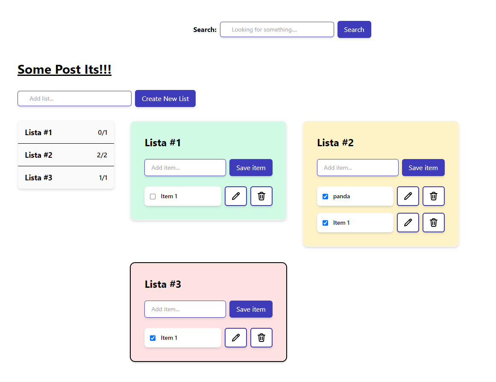

# CP Post Its
A simple web app for managing and organizing digital post-it notes. Where users can easily add, edit, and delete notes in real-time, while also benefiting from filtering and search functionality to quickly find specific notes.



### Tech:
- React
- TypeScript
- Vite
- Jest
- Tailwind


### Run:

```bash
npm install
npm run dev
npm run test
```

## Challenge

### TODO List

- [x] New Item
- [x] Edit Item
- [x] Delete item
- [x] Mark item as Done
- [x] _Bonus:_ Add more lists
- [x] Search
- [x] Sidebar click and show in the list
- [x] Show the number of check elementes per list 1/3, if 0 items show only 0
- [x] If all items check in a list, move the list to the bottoms lists and strikethrough the name 
- [ ] Unit testing
- [ ] Redux - Saga

